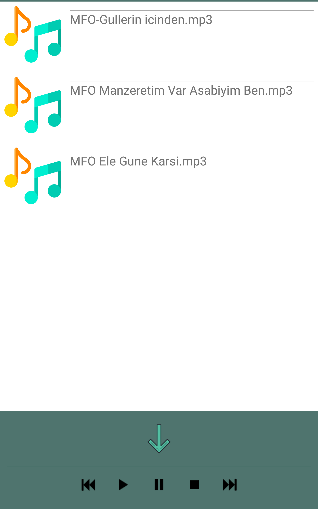

# Media Player

**It takes the sound files in the device and lists them in "RecyclerView". 
With this media player, you can play, stop and go previous and next between songs. 
Android's "MediaPlayer" library has been used.**

